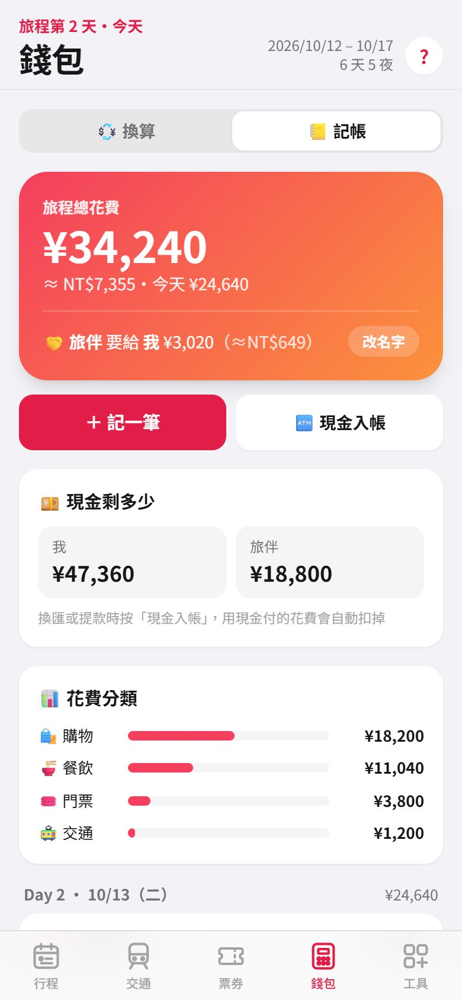

# 東京旅行

2026/10/12–10/17 東京 6 天 5 夜的行程網頁 App，給手機在旅途中使用：看行程、查交通、出示票券、換算日圓、記帳分帳。

**網址：<https://q23353723.github.io/Tokyo_Traval_Web/>**

可以加入 iPhone 主畫面當 App 使用、支援離線。操作說明在 App 右上角的 **?**，或「工具 → 使用說明」。

<p>
  
  
  
</p>

## 功能

| 分頁 | 內容 |
| --- | --- |
| 行程 | 每天的時間軸、天氣預報（日本氣象廳 JMA 模型）、當天要帶的東西、「我在這」進度（超前／落後）、候選店家勾選並串成 Google Maps 步行路線 |
| 交通 | 每段移動的搭乘路線、時間、注意事項、替代方案，一鍵開 Google Maps 導航 |
| 票券 | 預約行程自動列出，可存訂位編號、票券連結、QR Code 截圖；倒數下一個預約 |
| 錢包 | 日圓→台幣換算（免稅 10%、折扣）、退稅門檻累計、記帳＋兩人分帳、現金餘額 |
| 工具 | 搜尋附近、給司機看的全螢幕地址、緊急電話、出發前清單、購物清單、匯出行事曆（.ics）、本機資料備份 |
| 使用說明 | 加入主畫面、各分頁教學、備份還原（附截圖） |

## 檔案結構

```
index.html             整個 App（HTML＋Tailwind＋原生 JS，行程資料也在這裡）
sw.js                  Service Worker，離線快取
manifest.webmanifest   加入主畫面用的 App 設定
icon-*.png             App 圖示
guide/                 使用說明頁的截圖
```

沒有建置流程、沒有套件相依；Tailwind 由 CDN 載入。

## 本機開發

用任何靜態伺服器開啟即可（Service Worker 需要 `localhost` 或 HTTPS，直接開檔案時離線功能不會啟用）：

```bash
python -m http.server 8000
# 開啟 http://localhost:8000/
```

### 模擬旅途中的時間

網址加上 `?now=` 可以假裝現在是某個東京時間，用來檢查「表定現在」、「我在這」、營業中標示等只在旅途當天出現的功能：

```
http://localhost:8000/?now=2026-10-13T12:10
```

## 修改行程

行程資料都在 `index.html` 開頭的常數：

- `LINES`：交通路線的名稱、圖示、顏色
- `P`：常用地點（Google Maps 搜尋字串，用日文名稱最準）
- `DAYS`：每天的行程，欄位說明寫在 `DAYS` 上方的註解。常用的有：
  - `items[].t` / `end`：開始／結束時間（日本時間；`tw: true` 代表台灣時間）
  - `items[].leg`：對應到 `legs[].id`，顯示交通資訊
  - `items[].tags`：例如「已預約 11:30」，有標籤的行程會自動列入票券分頁與行事曆
  - `items[].shops`：候選店家清單
  - `bring`、`tips`：當天要帶的東西、小提醒

> 票券是用「日期＋行程標題」對應的。行程改名後，原本存的票券會移到票券分頁最下方的「其他」。

## 資料儲存

使用者輸入的資料（票券、記帳、清單、我的資料、勾選狀態）**只存在該裝置的瀏覽器**，不會上傳：

- `localStorage`：記帳、清單、設定、天氣與匯率快取
- `IndexedDB`（`tokyo-trip` / `tickets`）：票券與截圖

換手機或與旅伴共用時，用「工具 → 本機資料備份」匯出／匯入 JSON 備份檔。注意 iPhone 上主畫面 App 和 Safari 的資料是分開的。

## 外部服務

| 用途 | 服務 |
| --- | --- |
| 天氣預報 | [Open-Meteo](https://open-meteo.com/)（JMA 模型，以上野為代表點，快取 1 小時） |
| 匯率 | [ExchangeRate-API](https://www.exchangerate-api.com/) |
| 導航、搜尋附近 | Google Maps 網址（不需 API key） |

## 部署

推送到 `main` 後由 GitHub Pages 自動發布。Service Worker 對自己的檔案採網路優先（3 秒逾時改用快取），所以手機有網路時開啟就會拿到新版，不需要手動改快取版本。
